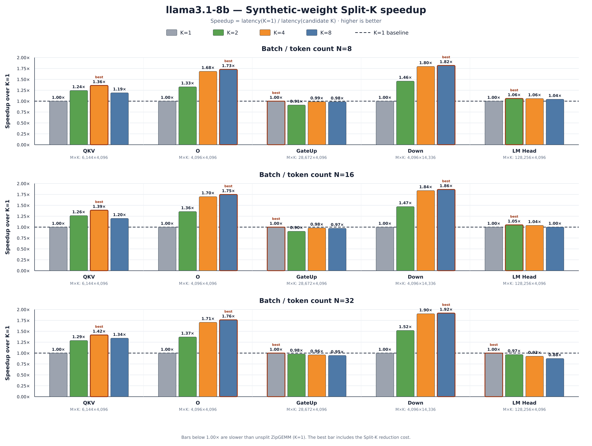
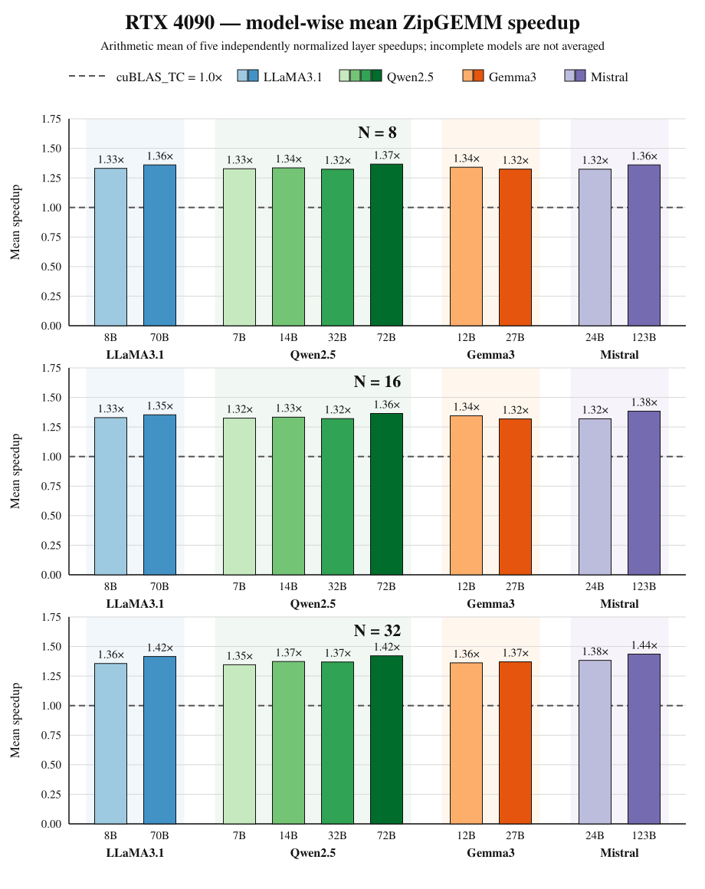
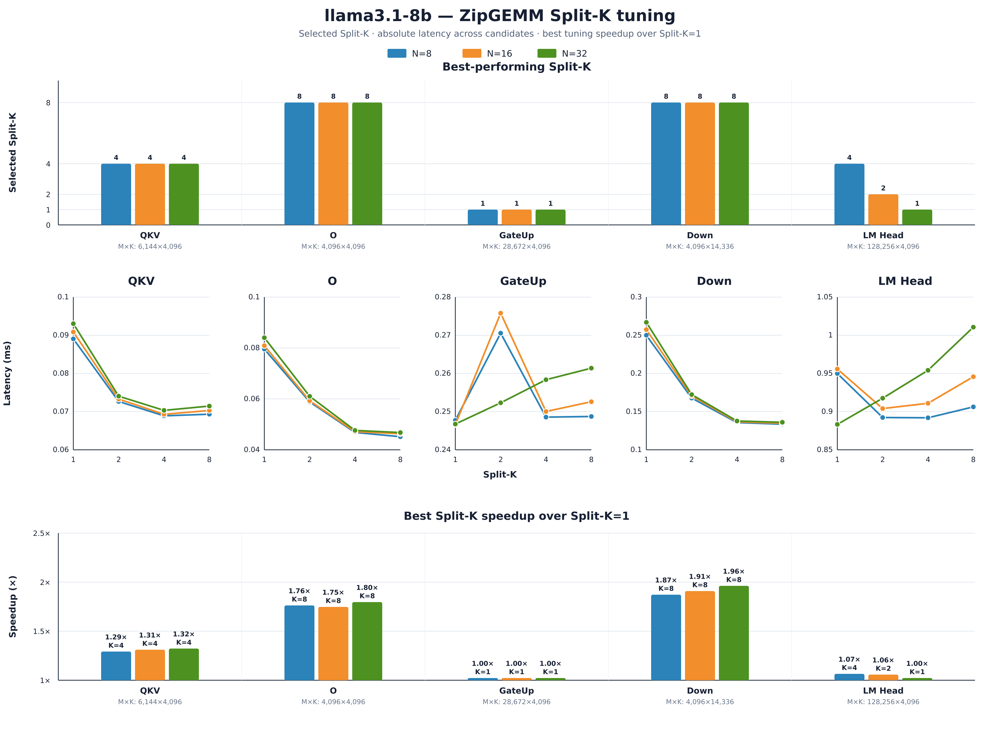
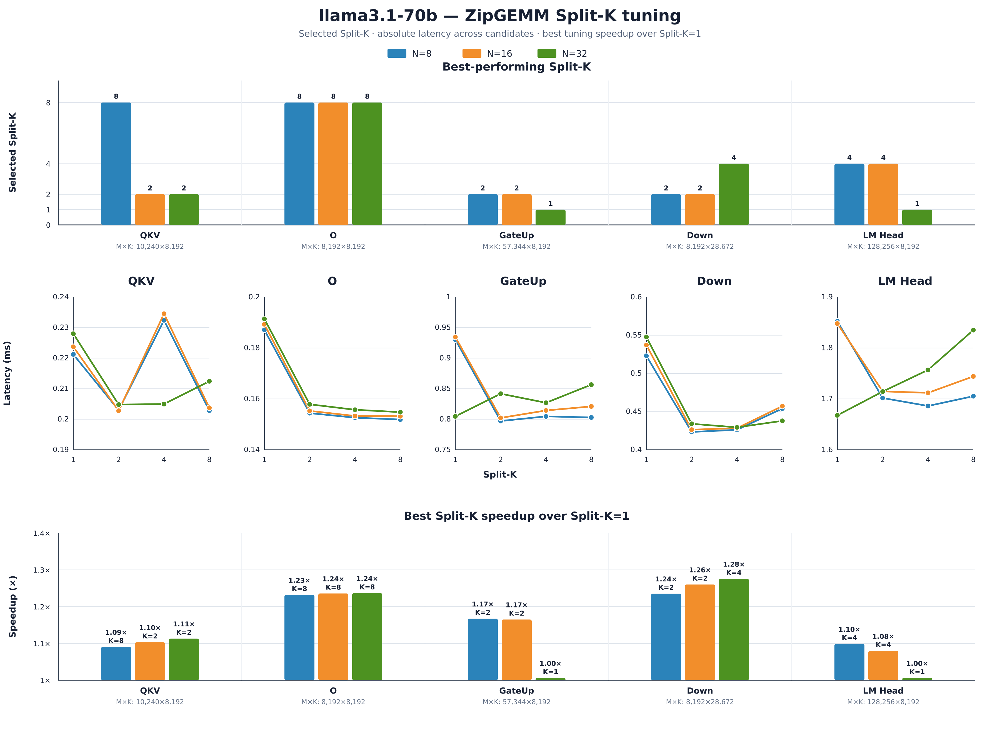
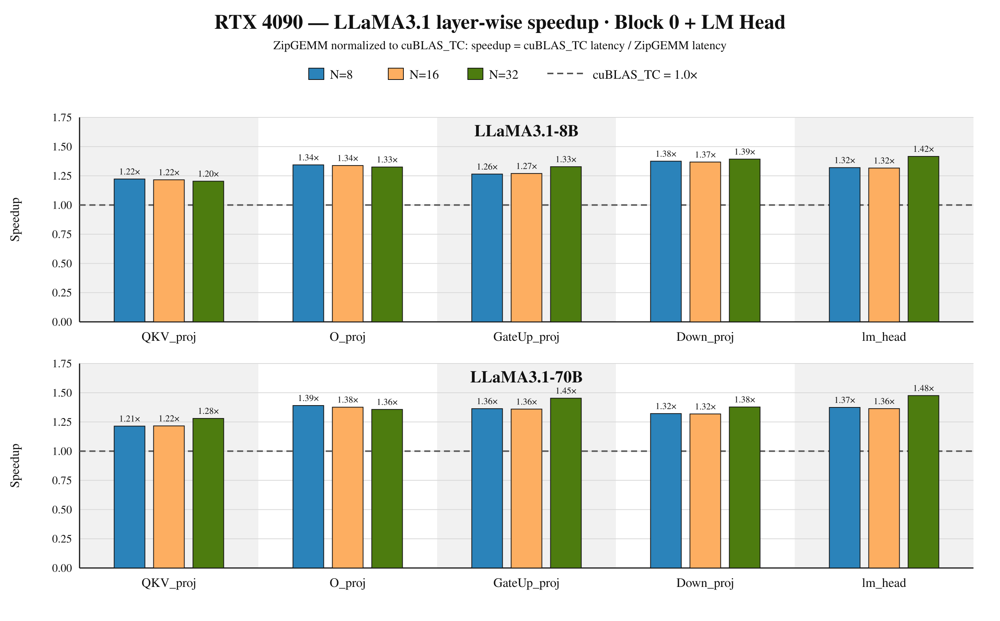
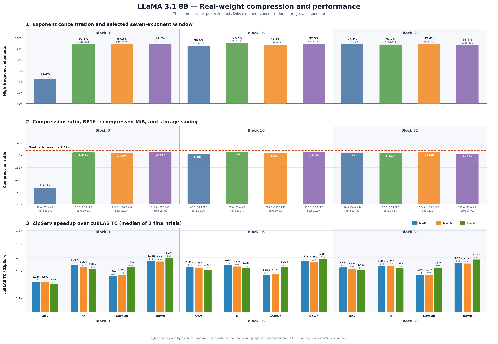
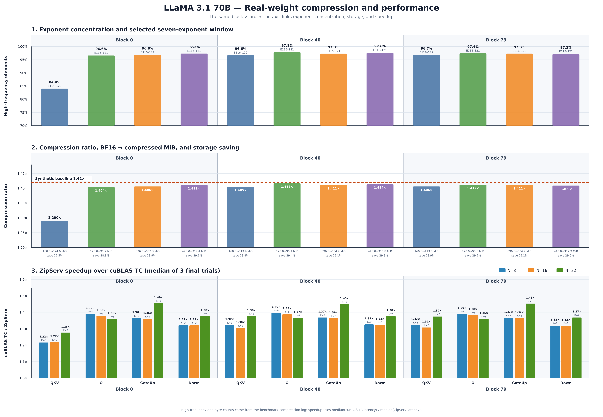

# ZipServ 실험 보고서 — 2026-08-26

## 요약

이번 실험의 목적은 다음 세 가지였다.

1. Split-K 후보 `1/2/4/8`의 동작과 projection별 최적값을 확인한다.
2. 동일한 exponent 분포를 갖는 synthetic weight에서 실제 Llama 3.1 weight로 전환하여 압축률과 성능 변화를 확인한다.
3. QKV/O projection의 성능이 기대보다 낮아지는 원인을 exponent 분포, 압축률 및 수치 오차 관점에서 조사한다.

주요 결론은 다음과 같다.

- Synthetic weight는 모든 행렬에 같은 exponent 분포를 적용하므로 압축률이 약 `1.42×`로 수렴했다.
- 실제 Llama weight의 압축률은 모델 전체에서 하나로 고정되지 않고 `model × transformer block × projection`마다 달랐다.
- 대부분의 실제 projection은 `1.40~1.42×`였지만 첫 번째 transformer block의 QKV는 8B에서 `1.267×`, 70B에서 `1.290×`로 낮았다.
- 8B block 0 QKV는 exponent `115~121`에 약 `81.18%`, 70B block 0 QKV는 `114~120`에 약 `84.03%`가 포함되었다. 다른 projection은 대체로 `96.5~97.8%`였다.
- 낮은 QKV 압축률은 낮은 ZipServ speedup과 함께 나타났다. 8B QKV는 block 0에서 약 `1.21×`, block 16/31에서 약 `1.32×`였고, 70B는 block 0에서 약 `1.24×`, block 40/79에서 약 `1.34×`였다.
- Split-K는 작은 M으로 output CTA가 부족한 O/Down에서 효과가 컸다. 반면 큰 M을 가진 GateUp/LM head는 특히 `N=32`에서 K=1이 유리했다.
- 현재 ZipServ latency는 본체와 reduction을 합친 end-to-end kernel latency다. 이번 보고서에서는 reduction 시간을 별도로 분리하지 않는다.
- 현재 exponent 선택 코드는 가장 많이 포함되는 연속 7개 구간을 보장하지 않는다. 구간별 빈도 합을 최대화하도록 개선하면 수치 손실 없이 압축률을 높일 가능성이 있다.

---

## 1. 실험 코드와 실행 구조

### 1.1 주요 코드

- 실험 진입점 및 cuBLAS/ZipServ 측정: [`benchmark/test_mm.cu`](benchmark/test_mm.cu)
- Synthetic weight 생성과 exponent 분석/압축: [`benchmark/utils.h`](benchmark/utils.h)
- Llama safetensors 로더: [`benchmark/llama_weight_loader.cpp`](benchmark/llama_weight_loader.cpp)
- 실험 설정: [`configs/experiments.json`](configs/experiments.json)
- Slurm 제출: [`slurm/run_zipserv.sh`](slurm/run_zipserv.sh)
- 결과 수집: [`scripts/collect_results.py`](scripts/collect_results.py)

ZipServ CUDA 커널은 별도 소스 디렉터리의 다음 파일을 사용한다.

- API와 Split-K 실행: [`L_API.cu`](/home/hybyun0207/ZipServ_ASPLOS26/csrc/L_API.cu)
- 압축 weight 복원 및 GEMM: [`L_Kernel.cuh`](/home/hybyun0207/ZipServ_ASPLOS26/csrc/L_Kernel.cuh)
- BF16 Tensor Core MMA: [`MMA_PTX.cuh`](/home/hybyun0207/ZipServ_ASPLOS26/csrc/MMA_PTX.cuh)
- Split-K reduction: [`Reduction_Kernel.cuh`](/home/hybyun0207/ZipServ_ASPLOS26/csrc/Reduction_Kernel.cuh)

### 1.2 결과 폴더

이 보고서에서 사용한 주요 결과는 다음과 같다.

| 구분 | 결과 디렉터리 |
|---|---|
| Synthetic Split-K tuning | [`results/zipserv-rtx4090-synthetic-20260822-tuning`](results/zipserv-rtx4090-synthetic-20260822-tuning) |
| Synthetic final run | [`results/zipserv-rtx4090-synthetic-20260822-202055-run`](results/zipserv-rtx4090-synthetic-20260822-202055-run) |
| Real Llama block 0 tuning | [`results/zipserv-rtx4090-llama31realblock0-20260825-tuning`](results/zipserv-rtx4090-llama31realblock0-20260825-tuning) |
| Real Llama block 0 final run | [`results/zipserv-rtx4090-llama31realblock0-20260825-024427-run`](results/zipserv-rtx4090-llama31realblock0-20260825-024427-run) |
| Real Llama 8B block 16/31 | [`results/zipserv-rtx4090-llama31realblock0-blocks-llama3_1_8b-b16-31-20260825-212459-run`](results/zipserv-rtx4090-llama31realblock0-blocks-llama3_1_8b-b16-31-20260825-212459-run) |
| Real Llama 70B block 40/79 | [`results/zipserv-rtx4090-llama31realblock0-blocks-llama3_1_70b-b40-79-20260825-212607-run`](results/zipserv-rtx4090-llama31realblock0-blocks-llama3_1_70b-b40-79-20260825-212607-run) |

### 1.3 실행 환경

| 항목 | 값 |
|---|---|
| GPU | NVIDIA GeForce RTX 4090, compute capability 8.9 |
| GPU memory | 24,564 MiB |
| CUDA | 12.8 |
| Driver | 580.126.09 |
| Weight/activation 입력 형식 | BF16 |
| N 후보 | 8, 16, 32 |
| Split-K 후보 | 1, 2, 4, 8 |
| Cache 조건 | 각 측정 직전 L2 flush |

`N`은 GEMM의 column 수이며 이 실험에서는 동시에 처리하는 token 수에 해당한다. 실제 serving batch size와 항상 같은 의미는 아니다.

Synthetic tuning은 `warmup=100`, `repeat=1000`, 후보당 1 trial로 수행했다. Synthetic final run은 선택된 Split-K로 `warmup=100`, `repeat=1000`, 3 trials를 수행했다.

Real block 0 tuning은 현재 설정상 `warmup=20`, `repeat=200`, 후보당 1 trial로 수행했다. Real final run은 `warmup=100`, `repeat=1000`, 3 trials다. 따라서 real tuning에서 후보 간 차이가 1% 미만인 선택은 추가 재검증이 필요하다.

### 1.4 Llama 행렬 크기

| 모델 | Projection | M | K |
|---|---|---:|---:|
| Llama 3.1 8B | QKV | 6,144 | 4,096 |
|  | O | 4,096 | 4,096 |
|  | GateUp | 28,672 | 4,096 |
|  | Down | 4,096 | 14,336 |
|  | LM head | 128,256 | 4,096 |
| Llama 3.1 70B | QKV | 10,240 | 8,192 |
|  | O | 8,192 | 8,192 |
|  | GateUp | 57,344 | 8,192 |
|  | Down | 8,192 | 28,672 |
|  | LM head | 128,256 | 8,192 |

QKV는 `q_proj`, `k_proj`, `v_proj`를 행 방향으로 이어 붙인 fused 행렬이다. GateUp도 `gate_proj`와 `up_proj`를 합친 행렬이다. LM head는 transformer block에 속하지 않는 모델 공용 tensor이므로 block별로 서로 다른 값으로 해석하면 안 된다.

Real-weight 실험에서 weight만 실제 checkpoint에서 읽는다. Activation B는 고정 seed로 생성한 synthetic BF16이다. 따라서 이 결과는 실제 weight 분포의 효과를 측정하지만 실제 inference activation 분포까지 재현한 실험은 아니다.

---

## 2. 비교군과 연산 정밀도

현재 벤치마크는 다음 세 결과를 저장한다.

| 결과 이름 | 입력 | Compute/accumulation | 출력 | 역할 |
|---|---|---|---|---|
| `cublas_non_tc` | BF16 × BF16 | FP32 compute, `CUBLAS_PEDANTIC_MATH` | BF16 | 수치 비교 기준 |
| `cublas_tc` | BF16 × BF16 | FP32 compute, `CUBLAS_DEFAULT_MATH` | BF16 | 주 성능 기준 |
| `zipserv` | 압축 BF16 × BF16 | 명시적 BF16 Tensor Core, FP32 accumulator | BF16 | 제안 방식 |

성능 지표는 다음과 같다.

```text
zipgemm_speedup_vs_tc = cublas_tc_latency / zipgemm_latency
```

`cublas_tc`는 가능한 경우 Tensor Core를 사용하는 cuBLAS 기본 고성능 모드다. ZipServ는 다음 PTX 명령으로 BF16 입력과 FP32 누산을 명시한다.

```text
mma.sync.aligned.m16n8k16.row.col.f32.bf16.bf16.f32
```

ZipServ는 압축된 weight tile을 global memory에서 읽고 shared memory/register에서 필요한 BF16 값을 복원한 뒤 곧바로 MMA에 전달한다. 복원된 전체 weight를 global memory에 쓰는 별도 decompression 단계는 없다.

주의할 점은 `CUBLAS_PEDANTIC_MATH`가 Tensor Core 미사용을 직접 보장하지 않는다는 것이다. 따라서 현재 `cublas_non_tc`는 보고서에서 `cuBLAS BF16 pedantic reference`로 표현하는 것이 안전하다. 실제 CUDA-core-only 여부는 Nsight Compute로 확인해야 한다.

---

## 3. ZipServ 압축 방식

### 3.1 압축률 정의

현재 압축률은 다음과 같이 계산한다.

```text
compression_ratio = original BF16 bytes / compressed bytes
```

압축 후 크기는 다음 항목을 포함한다.

```text
high-frequency 원소의 sign+mantissa 1 byte
+ non-high-frequency 원소의 full BF16 2 bytes
+ 세 개의 bitmap
+ medium/global tile offsets
```

예를 들어:

| 압축률 | 압축 후 크기/원본 | 공간 절감률 |
|---:|---:|---:|
| 1.42× | 약 70.4% | 약 29.6% |
| 1.29× | 약 77.5% | 약 22.5% |
| 1.27× | 약 78.7% | 약 21.3% |

### 3.2 Exponent 선택

BF16 bit 구성은 다음과 같다.

```text
sign 1 bit | exponent 8 bits | mantissa 7 bits
```

현재 host 압축 코드는 weight 행렬 전체의 exponent 빈도를 세고 빈도 상위 7개를 구한다. 이후 커널의 3-bit 연속 exponent 표현을 위해 연속된 7개 구간으로 조정한다.

선택 범위에 포함된 원소는 exponent를 직접 저장하지 않고 sign+mantissa와 bitmap code만 저장한다. 범위 밖 원소는 원래 BF16 값을 `compressed_full`에 저장한다. 따라서 현재 압축 자체는 범위 밖 값을 버리지 않는 무손실 방식이다.

### 3.3 현재 선택 로직의 한계와 개선안

현재 연속 구간 선택은 후보 exponent가 한 번이라도 존재하는지를 검사한다.

```cpp
if (exponent_map.count(current_exp + i) > 0)
```

이 방식은 포함 원소 수가 가장 큰 연속 7개 구간을 보장하지 않는다. 개선안은 가능한 모든 시작 exponent에 대해 다음 score를 계산하는 것이다.

```text
score(start) = count[start] + count[start+1] + ... + count[start+6]
```

최대 score 구간을 고르면 non-high-frequency 원소를 줄여 압축률과 memory traffic을 개선할 수 있다. 범위 밖 값은 계속 full BF16으로 저장하므로 이 변경은 수치 손실을 만들지 않는다.

---

## 4. Synthetic-weight 실험

### 4.1 압축률

Synthetic generator는 95% 확률로 지정된 exponent 집합에서 값을 생성한다. 나머지 임의 exponent도 일부 선택 구간과 겹치기 때문에 실제 high-frequency 비율은 약 97% 이상으로 나타난다.

모든 모델과 projection이 같은 통계적 생성 규칙을 사용하고 행렬이 충분히 크므로 압축률이 모두 약 `1.42×`로 수렴했다. 따라서 synthetic 결과의 동일한 압축률은 모델 고유 특성이 아니라 입력 생성 규칙의 결과다.

코드 주석은 97%라고 적혀 있지만 실제 조건은 `0.95f`다. 주석을 실제 구현에 맞게 수정할 필요가 있다.

### 4.2 선택된 Split-K

아래 각 셀은 `N=8/16/32` 순서다.

| 모델 | QKV | O | GateUp | Down | LM head |
|---|---:|---:|---:|---:|---:|
| Llama 3.1 8B | 4/4/4 | 8/8/8 | 1/1/1 | 8/8/8 | 2/2/1 |
| Llama 3.1 70B | 8/8/2 | 8/8/4 | 2/2/1 | 2/2/4 | 4/4/1 |
| Qwen 2.5 7B | 8/8/4 | 8/8/8 | 1/1/4 | 8/8/8 | 1/1/1 |
| Qwen 2.5 14B | 4/4/4 | 8/8/4 | 1/1/1 | 8/8/4 | 1/1/1 |
| Qwen 2.5 32B | 4/4/4 | 8/8/4 | 2/2/1 | 8/8/4 | 1/1/1 |
| Qwen 2.5 72B | 8/8/2 | 8/8/4 | 2/2/1 | 2/2/4 | 1/1/1 |
| Gemma 3 12B | 4/4/4 | 8/8/8 | 1/1/1 | 8/8/8 | 1/1/1 |
| Gemma 3 27B | 4/4/4 | 4/4/4 | 8/8/2 | 4/4/4 | 2/1/1 |
| Mistral 24B | 4/4/4 | 8/8/4 | 8/4/1 | 4/8/4 | 2/2/1 |
| Mistral 123B | 1/2/2 | 2/2/2 | 2/2/1 | 2/2/2 | 1/1/1 |

전반적인 경향은 다음과 같다.

- 작은 M의 O/Down은 Split-K로 output CTA 수를 늘리는 효과가 크다.
- 큰 M의 GateUp/LM head는 K=1에서도 CTA가 충분해 작은 Split-K 또는 K=1을 선택한다.
- N=32에서는 block 내부 N 방향 warp와 유효 연산이 증가하므로 큰 M projection에서 Split-K 필요성이 줄어든다.
- K가 클수록 Split-K를 덜 해야 하는 것은 아니다. 큰 K는 분할할 작업이 충분하고 reduction의 상대 비용이 작아져 Split-K에 유리한 요인이 된다.

Llama 3.1 8B에서 K=1 대비 최적 Split-K의 synthetic speedup은 다음과 같다.

| Projection | N=8 | N=16 | N=32 |
|---|---:|---:|---:|
| O | 1.73× | 1.75× | 1.76× |
| Down | 1.82× | 1.86× | 1.92× |

이 수치는 cuBLAS 대비가 아니라 **ZipServ K=1 대비 최적 Split-K speedup**이다.



전체 모델 그래프는 [`plots/image/synthetic/splitk_speedup`](plots/image/synthetic/splitk_speedup)에 있다.

### 4.3 Synthetic final 성능

다음은 각 모델에서 다섯 projection의 `zipgemm_speedup_vs_tc`를 산술 평균한 값이다. 각 projection 값은 final 3 trials의 median이다.

| 모델 | N=8 | N=16 | N=32 |
|---|---:|---:|---:|
| Llama 3.1 8B | 1.331× | 1.329× | 1.356× |
| Llama 3.1 70B | 1.360× | 1.353× | 1.415× |
| Qwen 2.5 7B | 1.327× | 1.325× | 1.346× |
| Qwen 2.5 14B | 1.335× | 1.333× | 1.373× |
| Qwen 2.5 32B | 1.324× | 1.321× | 1.369× |
| Qwen 2.5 72B | 1.367× | 1.364× | 1.421× |
| Gemma 3 12B | 1.340× | 1.345× | 1.362× |
| Gemma 3 27B | 1.324× | 1.318× | 1.370× |
| Mistral 24B | 1.324× | 1.319× | 1.383× |
| Mistral 123B | 1.360× | 1.384× | 1.436× |



---

## 5. 실제 Llama weight 실험

### 5.1 대상 weight

실제 Meta Llama 3.1 Instruct safetensors에서 다음 block을 사용했다.

| 모델 | 처음 | 중간 | 마지막 |
|---|---:|---:|---:|
| Llama 3.1 8B | 0 | 16 | 31 |
| Llama 3.1 70B | 0 | 40 | 79 |

Block 0은 Split-K `1/2/4/8`을 모두 tuning했다. 중간/마지막 block은 block 0에서 찾은 Split-K를 재사용하여 weight 분포 변화에 따른 압축률과 성능 변화를 확인했다.

### 5.2 실제 weight의 exponent와 저장 용량: Llama 3.1 8B

High-frequency 비율은 실행 로그가 출력한 값이며 padding이 포함되어 있어 실제 원소 분류 비율과 소폭 차이가 날 수 있다.

| Block | Projection | 선택 exponent | High-freq | 원본 MiB | 압축 MiB | 절감률 | 압축률 |
|---:|---|---:|---:|---:|---:|---:|---:|
| 0 | QKV | 115–121 | **81.18%** | 48.00 | 37.88 | **21.08%** | **1.267×** |
| 0 | O | 115–121 | 97.33% | 32.00 | 22.67 | 29.16% | 1.412× |
| 0 | GateUp | 115–121 | 97.21% | 224.00 | 158.82 | 29.10% | 1.410× |
| 0 | Down | 115–121 | 97.53% | 112.00 | 79.23 | 29.26% | 1.414× |
| 0 | LM head | 116–122 | 97.19% | 1,002.00 | 710.52 | 29.09% | 1.410× |
| 16 | QKV | 116–122 | 96.63% | 48.00 | 34.17 | 28.81% | 1.405× |
| 16 | O | 115–121 | 97.67% | 32.00 | 22.62 | 29.32% | 1.415× |
| 16 | GateUp | 116–122 | 97.10% | 224.00 | 158.94 | 29.04% | 1.409× |
| 16 | Down | 115–121 | 97.50% | 112.00 | 79.25 | 29.24% | 1.413× |
| 31 | QKV | 116–122 | 97.25% | 48.00 | 34.02 | 29.12% | 1.411× |
| 31 | O | 116–122 | 97.15% | 32.00 | 22.70 | 29.07% | 1.410× |
| 31 | GateUp | 116–122 | 97.44% | 224.00 | 158.56 | 29.21% | 1.413× |
| 31 | Down | 116–122 | 96.91% | 112.00 | 79.58 | 28.95% | 1.407× |

### 5.3 실제 weight의 exponent와 저장 용량: Llama 3.1 70B

| Block | Projection | 선택 exponent | High-freq | 원본 MiB | 압축 MiB | 절감률 | 압축률 |
|---:|---|---:|---:|---:|---:|---:|---:|
| 0 | QKV | 114–120 | **84.03%** | 160.00 | 123.98 | **22.51%** | **1.290×** |
| 0 | O | 115–121 | 96.58% | 128.00 | 91.16 | 28.78% | 1.404× |
| 0 | GateUp | 115–121 | 96.76% | 896.00 | 637.28 | 28.88% | 1.406× |
| 0 | Down | 115–121 | 97.31% | 448.00 | 317.42 | 29.15% | 1.411× |
| 0 | LM head | 115–121 | 97.67% | 2,004.00 | 1,416.28 | 29.33% | 1.415× |
| 40 | QKV | 116–122 | 96.64% | 160.00 | 113.90 | 28.81% | 1.405× |
| 40 | O | 115–121 | 97.83% | 128.00 | 90.36 | 29.41% | 1.417× |
| 40 | GateUp | 115–121 | 97.29% | 896.00 | 634.92 | 29.14% | 1.411× |
| 40 | Down | 115–121 | 97.58% | 448.00 | 316.81 | 29.28% | 1.414× |
| 79 | QKV | 116–122 | 96.74% | 160.00 | 113.82 | 28.86% | 1.406× |
| 79 | O | 115–121 | 97.41% | 128.00 | 90.62 | 29.20% | 1.412× |
| 79 | GateUp | 116–122 | 97.30% | 896.00 | 634.86 | 29.14% | 1.411× |
| 79 | Down | 115–121 | 97.10% | 448.00 | 317.88 | 29.04% | 1.409× |

LM head는 모델별 하나의 공용 tensor이므로 block 0 표에만 표시했다. block 16/31 및 40/79 결과 폴더에 복사된 LM head 행은 plotting 편의를 위한 중복 데이터다.

### 5.4 실제 block 0 Split-K 결과

아래 각 셀은 `N=8/16/32` 순서다.

| 모델 | QKV | O | GateUp | Down | LM head |
|---|---:|---:|---:|---:|---:|
| Llama 3.1 8B | 4/4/4 | 8/8/8 | 1/1/1 | 8/8/8 | 4/2/1 |
| Llama 3.1 70B | 8/2/2 | 8/8/8 | 2/2/1 | 2/2/4 | 4/4/1 |

8B 실제 block 0에서 K=1 대비 최적 Split-K의 end-to-end speedup은 다음과 같다.

| Projection | N=8 | N=16 | N=32 |
|---|---:|---:|---:|
| O, K=8 | 1.76× | 1.75× | 1.80× |
| Down, K=8 | 1.87× | 1.91× | 1.96× |

이 값에는 Split-K reduction 비용이 이미 포함되어 있다. 다만 K=4 대비 K=8의 추가 이득은 O에서 약 `1.8~3.7%`, Down에서 약 `1.2~1.6%`로 작다.





### 5.5 실제 weight 성능

다음 값은 각 block/projection에서 N=8/16/32의 final-run speedup을 평균한 것이다. 중간/마지막 block은 block 0 Split-K를 재사용했다.

#### Llama 3.1 8B

| Block | QKV | O | GateUp | Down |
|---:|---:|---:|---:|---:|
| 0 | **1.214×** | 1.333× | 1.289× | 1.381× |
| 16 | 1.320× | 1.336× | 1.294× | 1.377× |
| 31 | 1.319× | 1.334× | 1.291× | 1.367× |

#### Llama 3.1 70B

| Block | QKV | O | GateUp | Down |
|---:|---:|---:|---:|---:|
| 0 | **1.237×** | 1.376× | 1.393× | 1.340× |
| 40 | 1.334× | 1.386× | 1.394× | 1.343× |
| 79 | 1.335× | 1.378× | 1.395× | 1.335× |

가장 뚜렷한 변화는 QKV다.

```text
8B block 0 QKV:
high-frequency 81.18%, compression 1.267×, speedup 약 1.21×

8B block 16/31 QKV:
high-frequency 96.63~97.25%, compression 1.405~1.411×,
speedup 약 1.32×
```

```text
70B block 0 QKV:
high-frequency 84.03%, compression 1.290×, speedup 약 1.24×

70B block 40/79 QKV:
high-frequency 96.64~96.74%, compression 1.405~1.406×,
speedup 약 1.34×
```

이는 실제 weight의 exponent coverage가 압축률과 ZipServ 성능에 연결된다는 강한 정황이다. 반면 O projection은 실제 weight에서도 압축률 약 `1.40~1.42×`, speedup 약 `1.33~1.39×`로 현재 RTX 4090 결과에서는 QKV와 같은 저하가 뚜렷하지 않았다.



---

## 6. 압축 복원이 있는데도 ZipServ가 빠른 이유

현재 GEMM은 `N=8/16/32`인 skinny GEMM이다.

```text
FLOP = 2MKN
BF16 weight bytes ≈ 2MK
weight 기준 arithmetic intensity ≈ N FLOP/byte
```

N이 작아 Tensor Core 계산보다 weight를 HBM에서 읽는 시간이 지배적이다. 압축률 `1.42×`는 weight traffic을 약 `29.6%` 줄이고, `1.27×`는 약 `21.3%` 줄인다.

ZipServ는 별도 decompression kernel을 실행하지 않는다. 압축 tile을 읽고 비트 연산으로 BF16 값을 shared memory/register에서 복원하여 곧바로 Tensor Core MMA에 전달한다. 따라서 다음 비용이 없다.

- 전체 BF16 weight buffer 생성
- 복원 weight의 global-memory write
- GEMM에서 복원 weight를 다시 global-memory read

메모리 대기 시간에 일부 정수/비트 복원 연산을 겹칠 수 있기 때문에 절감된 HBM 시간이 복원 비용보다 크면 전체 latency가 감소한다.

Synthetic final 결과의 모든 150개 `model × projection × N` 조합과 real block 0의 30개 조합에서 ZipServ가 현재 cuBLAS TC 측정보다 빨랐다. Synthetic 범위는 약 `1.27~1.48×`, real block 0 범위는 약 `1.20~1.48×`였다.

다만 speedup에는 압축 효과뿐 아니라 custom tiling, Split-K 병렬화, cuBLAS generic kernel과의 차이가 함께 포함된다. 압축 효과만 분리하려면 동일한 tiling을 사용하는 uncompressed custom kernel과 비교해야 한다.

---

## 7. Split-K 해석

### 7.1 언제 Split-K가 유리한가

현재 커널의 `TILE_M`은 64이고 grid의 M 방향 크기는 다음과 같다.

```text
dimM = M × Split-K / 64
```

8B O/Down은 M=4,096이므로 K=1일 때 CTA가 64개뿐이다. K=8이면 512개로 증가해 GPU 병렬성이 개선된다. 반면 8B GateUp은 448개, LM head는 2,004개의 CTA가 K=1에서도 생성되어 추가 분할 이득이 작다.

N=32에서는 block 내부 N 방향 warp와 유효 계산량이 증가한다. 큰 M projection은 이미 CTA가 충분하기 때문에 workspace 쓰기와 reduction이 추가되는 Split-K가 불리해질 수 있다.

실제 N=32 latency 예시는 다음과 같다.

| 모델/Projection | K=1 | K=2 | K=4 | K=8 |
|---|---:|---:|---:|---:|
| 8B GateUp | **0.2467 ms** | 0.2523 | 0.2584 | 0.2614 |
| 8B LM head | **0.8833 ms** | 0.9176 | 0.9541 | 1.0106 |
| 70B GateUp | **0.8047 ms** | 0.8418 | 0.8270 | 0.8567 |
| 70B LM head | **1.6677 ms** | 1.7144 | 1.7569 | 1.8351 |

### 7.2 K가 클수록 덜 분할해야 하는가

그렇지 않다. 본체 연산량은 `O(MNK)`, reduction은 대략 `O(MN × Split-K)`이므로 K가 클수록 reduction의 상대 비용은 오히려 작아진다. 큰 K는 Split-K로 나눌 작업이 충분하다는 뜻이기도 하다.

실제로 8B Down은 `K=14,336`, 70B Down은 `K=28,672`로 가장 크지만 N=32에서도 각각 K=8, K=4가 선택되었다. Split-K는 K 하나가 아니라 M/N에 따른 output tile 수, 기본 CTA 수, GPU occupancy, K 길이, workspace와 reduction 비용을 함께 고려해야 한다.

---

## 8. 수치 오차

ZipServ K=1은 압축 weight를 정확히 BF16으로 복원하고 FP32로 누산한 뒤 BF16으로 저장한다. 큰 틀에서 cuBLAS TC의 BF16-input/FP32-compute/BF16-output과 같다.

Split-K가 2 이상이면 각 split의 FP32 누산 결과를 BF16 workspace에 저장하고 reduction에서 이를 다시 FP32로 변환해 합산한 뒤 최종 BF16으로 저장한다. 이 중간 BF16 반올림 때문에 Split-K가 커질수록 cuBLAS TC와의 차이가 증가할 수 있다.

Real block 0 tuning 전체에서 `zip_vs_tc_average_relative_error`의 median은 다음과 같았다.

| Split-K | Median average relative error |
|---:|---:|
| 1 | 0% |
| 2 | 약 0.584% |
| 4 | 약 1.137% |
| 8 | 약 1.231% |

상대 오차는 기준값이 0에 가까울 때 크게 증가할 수 있으므로 평균 상대 오차만으로 정확도를 판단하면 안 된다. 평균 절대 오차, significant error 비율 및 실제 모델 품질 평가가 함께 필요하다.

기존 오류 그래프는 다음과 같다.

- [Llama 3.1 8B real error](plots/image/real/llama/llama3.1-8b_error.png)
- [Llama 3.1 70B real error](plots/image/real/llama/llama3.1-70b_error.png)

---

## 9. 한계와 해석 시 주의점

1. **Exponent 구간 선택**

   현재 구현은 coverage 최대 연속 구간을 보장하지 않는다. 선택 로직을 수정한 뒤 압축률과 성능을 재측정해야 한다.

2. **Real tuning 반복 수**

   Real tuning은 20 warmups, 200 repeats, 1 trial이다. K=2/4/8의 차이가 1% 미만인 경우는 100/1000, 3 trials로 재검증해야 한다.

3. **중간/마지막 block의 Split-K**

   Block 16/31/40/79는 block 0 Split-K를 재사용했다. 현재 결과는 동일한 K에서 weight 분포 변화의 영향을 비교하기에 유용하지만 각 block의 최적 성능을 뜻하지 않는다.

4. **LM head 중복 행**

   Block별 결과 폴더의 LM head 행은 plotting 편의를 위해 block 0 결과를 복사한 것이다. 모델별 한 번만 집계해야 한다.

5. **High-frequency 비율의 padding**

   현재 로그의 high/non-high-frequency count에는 padding이 포함되어 두 백분율 합이 100%를 조금 넘을 수 있다. 실제 원소 coverage와 padded storage count를 분리해 CSV에 기록할 필요가 있다.

6. **Compression preprocessing 시간**

   Weight 분석과 host 압축 시간은 GEMM latency에 포함되지 않는다. Weight를 사전에 압축해 serving 중 재사용하는 상황을 가정한 측정이다.

7. **Cold-cache 조건**

   모든 반복 전에 L2 cache를 flush한다. 큰 모델의 layer weight를 순차 streaming하는 상황에는 합리적이지만 cache reuse가 높은 workload와는 차이가 날 수 있다.

8. **cuBLAS baseline**

   현재 `cublasGemmEx` 기본 알고리즘을 사용한다. cuBLAS Tensor Core 사용 여부와 공정한 최고 성능 비교를 위해 Nsight 확인과 `cublasLtMatmul` autotuning 비교가 필요하다.

9. **실제 입력 범위**

   실제 checkpoint 실험은 Llama 3.1 8B/70B weight만 포함한다. Qwen/Gemma/Mistral의 실제 weight와 실제 activation은 아직 포함하지 않았다.

---

## 10. 다음 시각화와 실험 우선순위

### 10.1 Real-weight 핵심 그림

동일한 x축 `block × projection`에 다음 세 패널을 배치한 핵심 그림을 생성했다.

1. High-frequency 비율과 선택 exponent 범위
2. 압축률, 원본/압축 MiB 및 절감률
3. cuBLAS TC 대비 ZipServ speedup

Synthetic `1.42×`를 압축률 패널의 점선 기준으로 표시했다. 각 성능 막대는 final 3 trials의 `median(cuBLAS TC latency) / median(ZipServ latency)`이며, 막대 위의 `K=`는 사용한 Split-K다.





그림에서 가장 뚜렷한 예외는 두 모델의 block 0 QKV다.

| 모델/Block/Projection | High-frequency | Exponent | 압축률 | 저장 절감 | ZipServ speedup 범위 |
|---|---:|---:|---:|---:|---:|
| 8B / 0 / QKV | 81.18% | 115–121 | 1.267× | 21.1% | 1.20–1.22× |
| 70B / 0 / QKV | 84.03% | 114–120 | 1.290× | 22.5% | 1.22–1.28× |

중간/마지막 block QKV는 high-frequency 비율이 약 `96.6~97.3%`, 압축률이 약 `1.405~1.411×`로 회복되며 speedup도 대체로 `1.30×` 이상이다. 따라서 synthetic weight에서 고정된 `1.42×` 하나만 보는 것보다 실제 block별 exponent 분포를 함께 보여주는 것이 필요하다.

### 10.2 상관관계 그림

다음 scatter plot을 추가한다.

```text
x축: compression ratio 또는 high-frequency 비율
y축: ZipServ speedup vs cuBLAS TC
색: projection
marker: model/block
```

이 그림은 낮은 QKV exponent coverage와 낮은 speedup의 상관관계를 직접 보여준다.

### 10.3 CSV에 추가할 항목

현재 일부 정보가 로그에만 있으므로 다음을 `result.csv`에 저장한다.

```text
selected_exp_start
selected_exp_end
high_freq_element_count
high_freq_percent_unpadded
high_freq_padded_count
non_high_freq_element_count
original_bytes
compressed_bytes
space_saving_percent
compression_ratio
```

### 10.4 후속 실험

우선순위는 다음과 같다.

1. Coverage 최대 연속 exponent 구간 선택 구현 및 smoke test
2. 기존 방식과 개선 방식의 high-frequency 비율/압축률 비교
3. Real block 0의 근소한 Split-K 후보를 100/1000, 3 trials로 재검증
4. Block 16/31/40/79의 Split-K 재-tuning
5. Nsight로 cuBLAS/ZipServ DRAM read bytes, Tensor Core utilization 및 memory stalls 확인
6. 동일 tiling의 uncompressed custom GEMM을 추가하여 압축 효과만 분리
7. 필요할 경우에만 QKV rare exponent를 근사하는 lossy degrade 실험 수행

Lossy degrade는 무손실 exponent 구간 최적화와 profiling 이후의 낮은 우선순위로 둔다.

---

## 11. 목표별 달성 상태

| 목표 | 상태 | 설명 |
|---|---|---|
| Split-K 후보별 개별 성능 | 완료 | Synthetic 전체 모델 및 real Llama block 0에서 1/2/4/8 측정 |
| Projection/N별 최적 Split-K | 완료 | Tuning CSV와 그래프 생성 |
| Layer별 선택 이유 분석 | 부분 완료 | M/N/K와 CTA 병렬성으로 설명, profiler 검증 필요 |
| Reduction 포함 순효과 | 완료 | 측정 latency가 본체+reduction 포함 |
| Reduction 시간 단독 분리 | 제외 | 이번 분석 범위에서 제외하기로 결정 |
| Synthetic → 실제 weight 전환 | 완료 | Llama 3.1 8B/70B block 0/중간/마지막 |
| 실제 exponent/압축률/용량 | 완료 | 로그 기반 상세 표 작성 |
| QKV 성능 저하 원인 | 유력한 근거 확보 | Block 0의 낮은 coverage/압축률/성능이 함께 나타남 |
| O 성능 저하 확인 | 현재는 미관찰 | O는 압축률과 speedup 모두 정상 범위 |
| BF16 outlier 인과 증명 | 미완료 | Coverage 최적화와 profiler/controlled 실험 필요 |
| Lossy degrade 전략 | 미수행 | 낮은 우선순위 |

## 최종 결론

Synthetic weight는 모든 행렬에 동일한 exponent 통계를 강제하여 압축률을 약 `1.42×`로 고정시켰다. 실제 Llama weight에서는 block과 projection에 따라 선택 exponent와 high-frequency 비율이 달랐으며, 특히 첫 번째 block의 QKV가 낮은 coverage를 보였다. 이로 인해 8B/70B block 0 QKV의 저장 절감률은 약 `21~23%`로, 다른 projection의 약 `29%`보다 작았고 ZipServ speedup도 함께 감소했다.

Split-K는 큰 K 자체보다 output tile 병렬성 부족을 해결하는 역할이 핵심이다. 작은 M의 O/Down에서는 reduction을 포함하고도 큰 이득을 보였고, 큰 M의 GateUp/LM head는 N=32에서 K=1이 유리했다. ZipServ가 압축 복원 비용에도 cuBLAS보다 빠를 수 있는 이유는 이 workload가 memory-bound이고, fused decompression이 전체 BF16 weight의 global-memory materialization 없이 약 `21~30%`의 weight traffic을 절약하기 때문이다.

다음 핵심 단계는 연속 exponent 7개 구간의 coverage를 실제로 최대화하도록 선택 로직을 수정하고, exponent/저장 용량 정보를 CSV에 구조화하여 압축률과 speedup의 관계를 직접 시각화하는 것이다.
