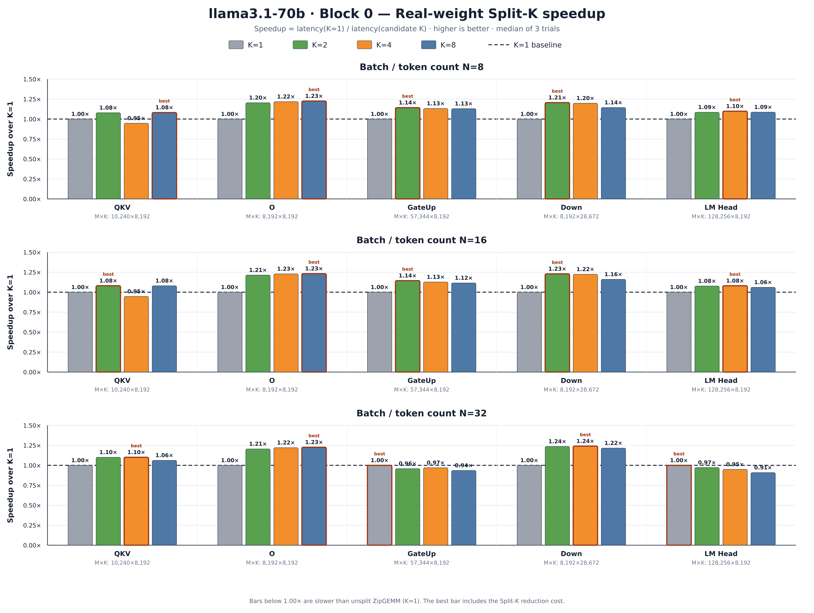
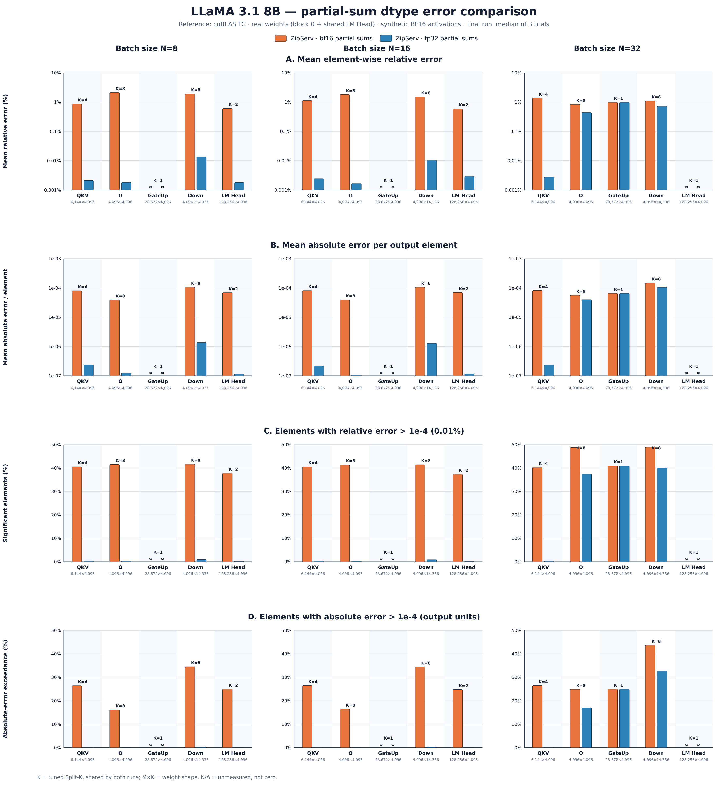

# ZipServ 실험 보고 — 2026-09-09

## 1. 요약

실제 LLaMA 가중치와 합성 BF16 activation을 사용한 GEMM 실험에서, Split-K는 일부 projection의 실행 시간을 단축했다. 제시한 LLaMA 3.1 70B block 0 결과에서는 O·Down projection이 미분할 대비 약 1.2배 빨라졌다. 다만 효과는 행렬 형상과 분할 수에 따라 달랐으며, 모든 조건에서 분할이 유리한 것은 아니다.

cuBLAS TC와의 출력 비교에서는 절대 차이 `1e-4`를 초과하는 원소 비율이 일부 조건에서 40%를 넘었다. 동일 Split-K에서 부분합 저장 형식을 BF16에서 FP32로 변경하자 차이가 크게 감소했다. 이는 중간 BF16 변환에 따른 반올림이 수치 차이의 주요 기여 요인임을 뒷받침한다.

N=32의 일부 조건에서는 FP32 부분합에서도 차이가 남았다. 이 잔여 차이를 **Tensor Core 자체의 오차로 단정할 수는 없다.** cuBLAS TC와 ZipServ의 누산·reduction·반올림 경로 차이가 후보 원인이며, 실제 모델 품질에 미치는 영향도 아직 검증하지 않았다.

## 2. 실험 범위와 비교 기준

- 모델: LLaMA 3.1 8B 및 70B.
- Transformer block: 8B는 0·16·31, 70B는 0·40·79.
- 연산: QKV, O, GateUp, Down. LM Head는 block별 연산이 아닌 공용 출력 head이며 block 0 결과에 포함한다.
- 입력: 실제 safetensors 가중치 + 합성 BF16 activation. 전체 모델 추론 실험은 아니다.
- 행렬곱: `W[M,K] × X[K,N] → Y[M,N]`, N=8·16·32.
- 반복: warmup 100회, 내부 측정 1000회, trial 3회. 그림은 trial별 지표의 중앙값을 사용한다.
- Split-K 탐색 후보: 1·2·4·8. 부분합 정밀도 비교에서는 기존 튜닝으로 선택한 동일 분할 수를 재사용했다.
- 오차 비교 대상: 최종 BF16 출력 행렬의 대응 원소. cuBLAS TC를 기준으로 한 차이는 엄밀한 정답 대비 오차와 구분한다.

이하에서 행렬의 축소 차원은 **K**, Split-K 분할 수는 **S**로 구분한다. 첨부 그래프의 범례 및 막대 위 `K=1/2/4/8`은 S를 뜻한다. 그림 아래 `M×K`는 가중치 형상이다.

## 3. 실제 가중치에서의 Split-K 성능



속도 향상은 `latency(S=1) / latency(S)`로 정의하며, Split-K reduction 비용을 포함한다. cuBLAS 대비 speedup이 아니라 **ZipServ 미분할 실행 대비 speedup**이다.

### 3.1 관찰 결과

제시한 70B block 0 그림에서:

| Projection | 관찰된 최적 speedup | 특징 |
| --- | --- | --- |
| O | 약 1.23× | N=8·16·32에서 분할 이득 관찰 |
| Down | 약 1.21~1.24× | N에 따라 최적 분할 수가 다름 |
| QKV | 약 1.08~1.10× | 일부 후보는 미분할보다 느림 |
| GateUp | N=8·16에서 약 1.14× | N=32에서는 S=1이 최적 |
| LM Head | N=8·16에서 약 1.08~1.10× | N=32에서는 S=1이 최적 |

수치는 그림에 표시된 반올림 값이다. 거의 같은 후보 간 작은 차이는 반복 측정의 변동성까지 확인해야 한다.

### 3.2 해석의 범위

실제 가중치에서도 Split-K가 유효하다는 것은 확인했다. 그러나 **K가 클수록 반드시 유리하다는 일반화는 하지 않는다.** 같은 K=8192인 O·GateUp·LM Head도 다른 결과를 보인다.

Split-K의 이득은 추가 병렬화로 얻는 이점과 부분합 저장·reduction 비용의 균형에 달려 있다. M·N·K, 타일 구성, 분할 수 등의 영향을 함께 받는다. 이번 결과에서 O·Down의 이득은 명확하지만, 개별 비용을 분리 측정하지 않았으므로 GEMM 본체의 절약 시간과 reduction 시간을 정량적으로 분해하지 않는다.

## 4. BF16 부분합과 FP32 부분합의 수치 차이



### 4.1 그림의 의미

네 패널은 cuBLAS TC의 최종 BF16 출력을 기준으로 다음을 나타낸다.

1. 출력 원소별 상대 차이의 평균.
2. 출력 원소당 평균 절대 차이(MAE).
3. 상대 차이가 `1e-4`, 즉 0.01%를 초과하는 원소 비율.
4. 절대 차이가 `1e-4`를 초과하는 원소 비율.

상대오차 패널의 기준값 0인 원소 처리는 벤치마크 구현 규칙을 따른다. 절대오차 임계값은 **0.0001이며 0.001이 아니다.** 임계 초과 비율의 분모는 가중치 원소 수가 아니라 출력 원소 수 M×N이다.

8B block 0의 BF16 부분합 결과에서 Down은 N=8·16에서 약 35%, N=32에서 약 44%의 출력 원소가 절대 차이 임계값을 초과한다. 이는 해당 조건의 수치적 불일치 비율이며, 모델 정확도가 그 비율만큼 감소했다는 의미는 아니다.

### 4.2 변경한 것은 부분합의 저장 정밀도

기존 구현도 각 split 내부의 누산은 FP32였다.

```text
기존 BF16 부분합:
FP32 부분합 계산 → BF16으로 변환·저장 → FP32 reduction → BF16 최종 출력

FP32 부분합:
FP32 부분합 계산 → FP32로 저장       → FP32 reduction → BF16 최종 출력
```

BF16으로 저장하며 손실된 정보는 이후 FP32로 확장해 더하더라도 복원되지 않는다. 동일한 분할 설정에서 이 중간 변환을 제거하자 많은 조건에서 차이가 크게 감소했다. 따라서 **BF16 부분합 저장에 수반되는 반올림이 주요 원인이라는 강한 실험적 근거**가 있다.

S=1에서는 분할 부분합 버퍼와 reduction이 없으며 두 옵션이 동일한 미분할 경로를 사용한다. 따라서 이 조건에서 부분합 저장 형식 변경의 효과를 기대할 수 없다.

## 5. N=32에서 남는 차이의 해석

### 5.1 관찰 사실

8B block 0의 N=32에서는 O·GateUp·Down에 FP32 부분합 적용 후에도 cuBLAS TC와의 차이가 남는다. 특히 GateUp은 S=1이므로 그 차이를 Split-K 부분합 저장 탓으로 설명할 수 없다.

최신 FP32 실행 CSV에서 확인한 출력 원소당 MAE는 다음과 같다. 수치는 trial 3회의 중앙값이며 표시 자릿수를 반올림했다.

| 연산, N=32 | cuBLAS TC ↔ non-TC | ZipServ FP32 ↔ non-TC | ZipServ FP32 ↔ TC |
| --- | ---: | ---: | ---: |
| QKV | 2.88e-7 | 8.14e-8 | 2.35e-7 |
| O | 3.96e-5 | 2.02e-8 | 3.96e-5 |
| GateUp | 6.52e-5 | 1.54e-7 | 6.52e-5 |
| Down | 1.05e-4 | 1.38e-7 | 1.05e-4 |

O·GateUp·Down에서는 ZipServ FP32가 non-TC 결과에 훨씬 가깝고, ZipServ↔TC 차이는 TC↔non-TC 차이와 거의 같은 크기이다. non-TC 역시 수학적 정답 자체는 아니지만, TC를 기준으로 한 그림만으로 정확도를 판정해서는 안 된다는 근거다.

### 5.2 아직 확정하지 않은 원인

ZipServ와 cuBLAS TC 모두 Tensor Core를 사용하므로, **Tensor Core 사용 자체가 원인이라는 설명은 충분하지 않다.** 행렬 형상에 따른 내부 커널 선택, 누산 순서, 중간 reduction 정밀도 및 반올림 경로 차이가 후보이다.

현재 자료는 cuBLAS 내부의 구체적인 reduction 정밀도나 실행 커널을 직접 확인한 결과가 아니다. 따라서 저정밀 reduction 사용 여부 등은 가설로 남긴다. 또한 N=32에서도 모든 projection에 큰 차이가 생기는 것은 아니다.

확정에 필요한 최소 비교는 동일 입력에 대해 기존 cuBLAS TC, 저정밀 reduction을 금지한 cuBLAS TC, 명시적인 엄격한 FP32 연산 후 BF16 변환 기준을 함께 측정하는 것이다. 필요하면 실행 커널도 추적한다. 이 추가 검증은 본 보고 시점에 완료했다고 주장하지 않는다.

## 6. 결론과 한계

- 실제 가중치 기반 GEMM에서도 Split-K의 성능 이득을 확인했다. 다만 최적 분할 수와 이득은 형상에 의존한다.
- BF16 부분합 저장은 cuBLAS TC와의 출력 차이에 크게 기여한다. FP32 부분합 저장으로 상당 부분 완화할 수 있다.
- N=32의 잔여 차이는 부분합 저장만으로 설명할 수 없으며, Tensor Core 자체의 오차로 단정하지 않는다.
- 오차 그림의 기준은 cuBLAS TC이며, 임계 초과 원소 비율은 모델 품질 저하율이 아니다.
- 현재는 실제 가중치와 합성 activation을 사용하는 개별 GEMM 평가다. 실제 activation, 전체 모델의 perplexity·과제 정확도 등은 별도 검증이 필요하다.
- BF16 부분합에서 얻은 최적 Split-K를 FP32 실험에 재사용했으므로, FP32 경로 자체의 최적 성능을 다시 튜닝한 결과는 아니다.

## 7. 결과 자료

- [BF16 부분합 튜닝 결과](results/zipserv-rtx4090-llama31-realweights-3blocks-abserror-20260907-204057-tuning/result_all.csv)
- [재사용한 selected_splitk.csv](results/zipserv-rtx4090-llama31-realweights-3blocks-abserror-20260907-204057-tuning/selected_splitk.csv)
- [BF16 부분합 본 실험 결과](results/zipserv-rtx4090-llama31-realweights-3blocks-abserror-20260907-204057-run/result_all.csv)
- [FP32 부분합 본 실험 결과](results/zipserv-rtx4090-realsafetensors-blocks-llama3_1_8b-b0-16-31-llama3_1_70b-b0-40-79-partial-fp32-20260908-174028-run/result_all.csv)

본 보고서는 기존 실험 결과와 제공된 그래프를 정리한 것이며, 작성 과정에서 추가 GPU 실험을 수행하지 않았다.


# Split-K 동작 예시 — M=128, K=640, N=64, SplitK=4

이 문서는 [01_select_splitk.py](01_select_splitk.py)~[05_reduce_partial_outputs.cuh](05_reduce_partial_outputs.cuh)에서
발췌한 코드를 하나의 구체적인 GEMM 설정에 그대로 대입해서, Split-K가 실제로
K 방향을 어떻게 자르고 어떻게 다시 합치는지 처음부터 끝까지 따라가 본
학습 노트다. 숫자는 일부러 `TILE_K=64`로 딱 나누어떨어지지 않게 골랐다
(뒤에서 보듯 마지막 split이 다른 split보다 적게 일한다).

## 0. 설정값

| 이름 | 값 | 비고 |
|---|---:|---|
| `M_Global` | 128 | `TILE_M=64`이므로 M-tile 2개 |
| `N_Global` | 64 | `TILE_N=64`인 specialization이 선택됨 (아래 1절) |
| `K_Global` | 640 | `TILE_K=64`이므로 `NumKBlock = 640/64 = 10` |
| `Split_K` | 4 | `01_select_splitk.py`의 후보 `[1,2,4,8]` 중 하나라고 가정 |

`K_Global=640`, `Split_K=4`를 고른 이유: `NumKBlock=10`은 `4`로 나누어떨어지지
않는다(`10 / 4 = 2.5`). [04_partition_k.cuh](04_partition_k.cuh)의 ceil 기반
분할 공식과, 그 결과로 마지막 split만 더 적은 K-tile을 받는 padding 현상을
숫자로 직접 보기 위한 설정이다.

## 1. Grid 계산 — [03_launch_grid.cu](03_launch_grid.cu)

```cpp
int dimN = (N_Global + ConfigType::TILE_N - 1) / ConfigType::TILE_N;
int dimM = M_Global * Split_K / ConfigType::TILE_M;
dim3 GridDim(dimN, dimM, 1);
```

`N_Global=64`는 `N<=8`도 아니고 `N>128`도 아니므로 세 번째 분기로 간다.

```cpp
int block_col_warps = (N_Global + 15) / 16;   // (64+15)/16 = 4
```

`block_col_warps=4`는 `TILE_N = 16 * block_col_warps = 64`에 대응하는
specialization이다 (comment의 "N=16이면 1, N=32이면 2" 규칙을 그대로 연장한 것).
즉 이 예시는 `TILE_N=64`가 선택된다.

그러면:

```text
dimN = ceil(64 / 64)      = 1
dimM = (128 * 4) / 64     = 8

GridDim = (1, 8, 1)   →  thread block 8개
```

`N` 방향은 한 tile로 끝나므로(`blockIdx.x`는 항상 0), 이 예시의 흥미로운 부분은
전부 `blockIdx.y`(0~7) 8개 값 안에 들어 있다.

## 2. blockIdx.y 분해 — [04_partition_k.cuh](04_partition_k.cuh)

```cpp
const int SplitID = blockIdx.y / (M_Global / TilingConfig::TILE_M);  // 나누는 수 = 128/64 = 2
const int y       = blockIdx.y % (M_Global / TilingConfig::TILE_M);
```

`M_Global / TILE_M = 2`(M-tile이 2개)이므로 `blockIdx.y`는 "Split 번호 하나당
M-tile 2개"로 접혀 있다.

| `blockIdx.y` | `SplitID` (K split) | `y` (M-tile) | 담당 M 범위 |
|---:|---:|---:|---|
| 0 | 0 | 0 | 행 0–63 |
| 1 | 0 | 1 | 행 64–127 |
| 2 | 1 | 0 | 행 0–63 |
| 3 | 1 | 1 | 행 64–127 |
| 4 | 2 | 0 | 행 0–63 |
| 5 | 2 | 1 | 행 64–127 |
| 6 | 3 | 0 | 행 0–63 |
| 7 | 3 | 1 | 행 64–127 |

즉 8개 block은 "M-tile 2개 × Split 4개"의 모든 조합이고, 각 block은 **같은
`(M-tile, N-tile)` 출력 영역을 서로 다른 K 구간으로만** 계산한다.

## 3. 각 split이 맡는 K 구간 — 핵심 계산

```cpp
const int NumKBlock        = K_Global / TILE_K;              // 640/64 = 10
const int AverageNumKBlock = (NumKBlock - 1) / Split_K + 1;  // ceil(10/4) = 3
const int RoundedKBlock    = AverageNumKBlock * Split_K;     // 3*4 = 12
const int PaddingKBlock    = RoundedKBlock - NumKBlock;      // 12-10 = 2

int NumIter = IsLastSplit ? (AverageNumKBlock - PaddingKBlock) : AverageNumKBlock;
```

`AverageNumKBlock=3`이 앞의 split 세 개(`SplitID=0,1,2`) 각각의 K-tile 개수이고,
마지막 split(`SplitID=3`)만 `3 - 2 = 1`개로 줄어든다. `BlockOffset`(K-tile 시작
위치)은 `SplitID * AverageNumKBlock`이다.

| `SplitID` | `IsLastSplit` | K-tile 시작 | `NumIter` (K-tile 개수) | 담당 K 범위 |
|---:|:---:|---:|---:|---|
| 0 | ✗ | 0 | 3 | `[0, 192)` |
| 1 | ✗ | 3 | 3 | `[192, 384)` |
| 2 | ✗ | 6 | 3 | `[384, 576)` |
| 3 | ✓ | 9 | 1 | `[576, 640)` |

검산: `3+3+3+1 = 10 = NumKBlock`. K-tile 10개가 겹치지도, 비지도 않고 정확히
한 번씩 4개 split에 나뉜다. `Split_K=4`가 `NumKBlock=10`을 나누어떨어지게
하지 못해도 정확성은 깨지지 않고, 대신 **마지막 split의 부하가 다른 split의
1/3**로 작아진다 — Split-K를 크게 잡을수록 이런 불균형이 상대적으로 커질 수
있다는 뜻이다.

`B`(dense matrix)와 bitmap 포인터도 같은 오프셋으로 이동한다.

```cpp
const __nv_bfloat16* BTileGlobalPTR =
    B + Tile_Start_N * K_Global + SplitID * AverageNumKBlock * TILE_K;
```

예를 들어 `SplitID=2`인 block은 `B`에서 `K` 오프셋 `2*3*64 = 384`부터 읽기
시작하고, `NumIter=3`번의 K-loop 동안 `[384, 576)` 구간만 훑는다 — 위 표와
정확히 일치한다.

## 4. 각 block이 partial output을 쓰는 위치

```cpp
__nv_bfloat16* OutputPTR =
    Output + SplitID * (M_Global * N_Global) + Tile_Start_M + Tile_Start_N * M_Global;
```

`Split_K=4 > 1`이므로 `Output`은 `C`가 아니라
`Reduction_Workspace_BF16TripleBitmap`이다 (크기 `M*N*Split_K = 128*64*4 = 32768`
BF16 원소, [02_benchmark_handoff.cu](02_benchmark_handoff.cu) L20~25). `M*N = 8192`이므로
workspace는 split마다 8192개짜리 구간이 이어 붙은 모양이다.

| `SplitID` | `y` | `Tile_Start_M` | `Tile_Start_N` | `OutputPTR` 오프셋 | 사용한 K 범위 |
|---:|---:|---:|---:|---:|---|
| 0 | 0 | 0 | 0 | `0*8192 + 0`     = 0 | `[0,192)` |
| 0 | 1 | 64 | 0 | `0*8192 + 64`    = 64 | `[0,192)` |
| 1 | 0 | 0 | 0 | `1*8192 + 0`     = 8192 | `[192,384)` |
| 1 | 1 | 64 | 0 | `1*8192 + 64`    = 8256 | `[192,384)` |
| 2 | 0 | 0 | 0 | `2*8192 + 0`     = 16384 | `[384,576)` |
| 2 | 1 | 64 | 0 | `2*8192 + 64`    = 16448 | `[384,576)` |
| 3 | 0 | 0 | 0 | `3*8192 + 0`     = 24576 | `[576,640)` |
| 3 | 1 | 64 | 0 | `3*8192 + 64`    = 24640 | `[576,640)` |

즉 workspace는 `[split 0의 전체 C 모양][split 1의 전체 C 모양][split 2][split 3]`
순서로 이어진 4장의 "부분 C"다. 각 부분 C는 **같은 (m, n) 위치에, 서로 다른
K 구간만 곱해서 더한 값**을 담고 있다.

## 5. Reduction — [05_reduce_partial_outputs.cuh](05_reduce_partial_outputs.cuh)

```cpp
dim3 GridDim((M_Global * N_Global) / 256, 1, 1);   // 8192/256 = 32
SplitK_Reduction_BF16<<<GridDim, BlockDim, 0, stream>>>(
    C, Reduction_Workspace, M_Global, N_Global, Split_K);
```

reduction block 32개가 `M*N=8192`개 출력 원소를 256개씩 나눠 맡는다. 한
block 안에서 thread 하나가 8개 원소(`HALF_PER_128B`)를 담당하고, `Split_K=4`
번 루프를 돌며 `R_BasePTR_ThisBlock`을 `M*N=8192`씩 앞으로 옮긴다 — 이 이동
폭이 정확히 4절 표의 split 간격과 같다.

구체적으로 `m=0, n=0`(`C`의 첫 원소, flat index 0)을 예로 들면, 이 값은
reduction block 0의 thread 0이 담당한다.

```text
Results[0] = bf16_to_float(WS[0])       // split0, K∈[0,192) 로 계산한 부분합
           + bf16_to_float(WS[8192])    // split1, K∈[192,384)
           + bf16_to_float(WS[16384])   // split2, K∈[384,576)
           + bf16_to_float(WS[24576]);  // split3, K∈[576,640)

C[0] = float_to_bf16(Results[0]);
```

`K=0..639` 전체에 대한 내적을 4조각으로 나눠 각자 BF16 partial sum으로
저장했다가, 여기서 FP32로 승격해 더한 뒤 다시 BF16으로 내림한다.

### 정밀도/비용 관점에서 짚어둘 점

- Split-K가 없으면(`Split_K=1`) K=640 전체를 커널 안의 FP32 accumulator
  `c`에서 한 번에 누적하고 끝에 한 번만 BF16으로 반올림한다.
- Split-K가 있으면 각 split이 **자기 몫만 FP32로 누적한 뒤 BF16으로
  한 번 내림**해서 workspace에 쓰고, reduction 커널이 그 BF16 값들을 다시
  FP32로 올려 더한 뒤 최종 BF16으로 내림한다. 즉 BF16 왕복이 한 번 더
  생긴다. Split-K를 늘리면 병렬성(동시에 실행되는 thread block 수)은
  늘지만, workspace 크기(`M*N*Split_K`)와 이 추가 reduction 비용이 같이
  늘어난다 — [README.md](README.md)의 핵심 식/주의사항 절과 이어지는 trade-off다.

## 6. 전체 그림

```text
C[128,64] = A[128,640] × B[640,64]

K=640을 TILE_K=64로 나누면 NumKBlock=10
Split_K=4 → ceil(10/4)=3개씩, 마지막만 1개

        K: 0        192       384       576   640
           ├─────────┼─────────┼─────────┼─────┤
split 0    │ 3 tiles │
split 1              │ 3 tiles │
split 2                        │ 3 tiles │
split 3                                  │1tile│

M-tile 0(행0-63) × 4 splits ─┐
M-tile 1(행64-127) × 4 splits┴─→ blockIdx.y = 0..7 (8 thread block)

각 block: 자기 (M-tile, split) 조합의 K 구간만 계산
        → FP32 accumulator c에 부분합 누적
        → BF16으로 내림해서 workspace[SplitID*8192 + ...]에 기록

SplitK_Reduction_BF16 (block 32개, thread당 원소 8개):
    C[m,n] = bf16→f32(split0[m,n]) + bf16→f32(split1[m,n])
           + bf16→f32(split2[m,n]) + bf16→f32(split3[m,n])
    → f32→bf16 → 최종 C[128,64]에 기록
```
